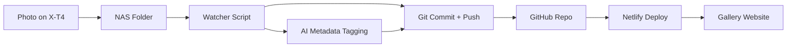

# Project Paper – Monochrome Flow

## Project Name and Repository

* **Project Name:** Monochrome Flow
* **GitHub Repository Name:** `monochrome-flow`

The name emphasizes the continuous pipeline (flow) from camera to web, with a focus on black & white portraiture.

---

## Vision

A digital photography project centered on black & white portraits shot with the Fuji X‑T4. The website will serve as a curated gallery and recipe log, where styles are defined by mood. AI tools will support metadata enrichment, tagging, and curation over time. The pipeline aims to be automated, from local NAS storage to public web gallery.

---

## Objectives

1. Build a content pipeline from **Synology NAS → GitHub → Netlify/Eleventy site**.
2. Automate photo upload and gallery updates with minimal manual work.
3. Enable future AI-driven curation: tagging, style recognition, mood-based collections.
4. Keep the system modular, reproducible, and open for extensions.

---

## Technical Architecture

### Core Components

* **NAS (Synology):** Initial storage and watch folder for new photos.
* **Automation Layer:** Script/cronjob or Docker container to detect new files, commit, and push to GitHub.
* **GitHub:** Single source of truth. Holds Eleventy website and media assets.
* **Netlify:** Deployment platform, triggered on GitHub push.
* **Eleventy (11ty):** Static site generator for fast, flexible photo galleries.

### Optional/Planned AI Components

* **Metadata Generator:** Local AI (CLIP, ComfyUI, Flux, etc.) creates JSON sidecar files with tags, moods, recipes.
* **Curator:** Reads metadata and creates dynamic collections in Eleventy.

### Pipeline Flow

1. **Capture:** Fuji X‑T4 → import to Synology NAS.
2. **NAS Watcher:** Detect new files, run script.
3. **Automation:** Add files to GitHub repo (with metadata if available).
4. **Push:** Trigger Netlify build.
5. **Publish:** Site updated automatically.

---

## Deliverables

* **MVP:**

  * GitHub repo with Eleventy site scaffold
  * Netlify deployment linked to repo
  * Synology script for auto-commit/push
  * Basic gallery with manual captions

* **Future:**

  * AI metadata sidecar integration
  * Mood/style-based collections
  * Search and filter features

---

## Workstreams

1. **Infrastructure Setup**

   * Create GitHub repo
   * Connect to Netlify
   * Set up Eleventy base site

2. **NAS Integration**

   * Write watcher script (bash/python)
   * Configure Synology Task Scheduler or Docker container
   * Automate git commit & push

3. **Gallery Design**

   * Choose minimal theme
   * Create template for photo pages
   * Add EXIF + caption support

4. **AI Curation (Phase 2)**

   * Experiment with local tagging models
   * Define JSON schema for metadata
   * Extend Eleventy to use metadata

---

## Risks & Mitigations

* **Large file sizes:** Mitigate via resizing/thumbnailing before upload.
* **NAS offline:** Ensure queueing or retry logic in script.
* **AI accuracy:** Start with manual overrides; keep AI metadata optional.

---

## Next Steps

1. Initialize GitHub repo `monochrome-flow`. (Done)
2. Scaffold Eleventy site with sample gallery.
3. Set up Netlify CI/CD.
4. Write first version of NAS upload → commit script.
5. Deploy MVP and test end-to-end.

---

## Long-term Vision

A living, AI-assisted digital gallery where each portrait is not only displayed but contextualized with styles, moods, and recipes. The site evolves as the photographer’s creative process evolves, blending craft, automation, and curation into one continuous flow.
